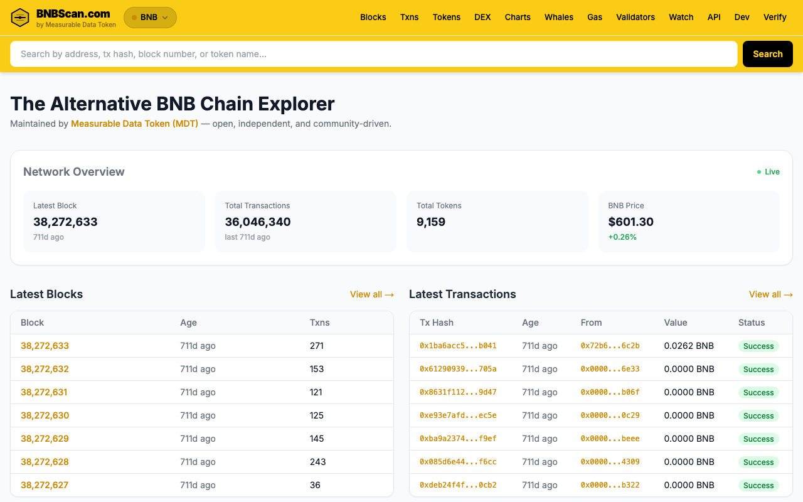
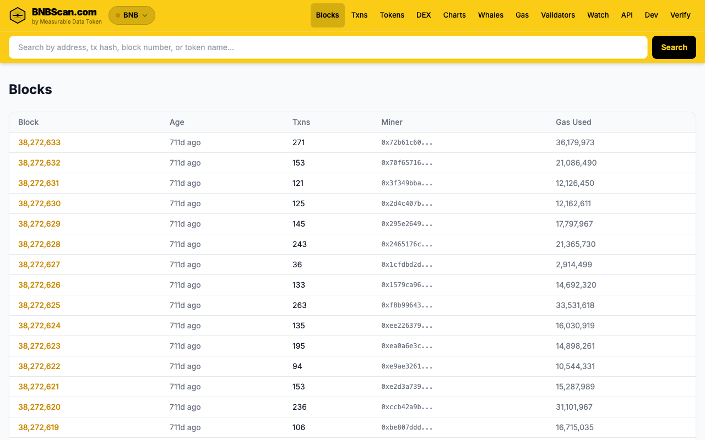
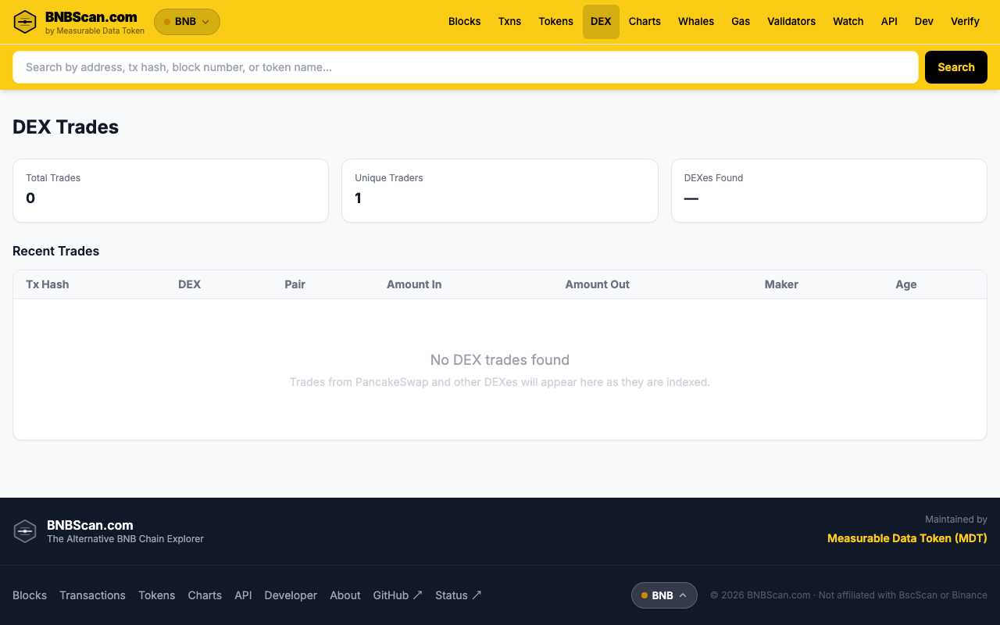

<p align="center">
  
</p>

<h1 align="center">Altscan</h1>

<p align="center">
  The open-source, multi-chain block explorer platform.<br/>
  One codebase powers independent explorers for <strong>BNB Chain</strong> and <strong>Ethereum</strong> today — and is built to add more chains over time.<br/>
  Next.js 14, Drizzle ORM, and ethers.js. Maintained by <a href="https://mdt.io">Measurable Data Token (MDT)</a>.
</p>

<p align="center">
  <a href="https://altscan.io"><strong>altscan.io</strong></a> &nbsp;|&nbsp;
  <a href="https://bnbscan.com"><strong>bnbscan.com</strong></a> &nbsp;|&nbsp;
  <a href="https://ethscan.io"><strong>ethscan.io</strong></a>
</p>

<p align="center">
  <a href="https://github.com/heathermhuang/altscan/actions/workflows/ci.yml"></a>
  <a href="LICENSE"></a>
  
  <a href="CONTRIBUTING.md"></a>
</p>

---

## What is this?

**Altscan** is an open-source, multi-chain block explorer platform. One codebase powers two independent explorers today — **BNBScan** ([bnbscan.com](https://bnbscan.com), BNB Chain) and **EthScan** ([ethscan.io](https://ethscan.io), Ethereum) — and is designed to extend to more chains over time. They are fully independent from BscScan, Etherscan, Binance, or the Ethereum Foundation, providing a clean, fast interface for exploring blocks, transactions, addresses, tokens, and on-chain activity.

A single `CHAIN` environment variable selects which chain a deployment serves — same frontend, same indexer, same schema.

## Screenshots

| Homepage | Blocks |
|:---:|:---:|
|  |  |

| DEX Trades | Status Page |
|:---:|:---:|
|  |  |

> **Note:** To regenerate screenshots, visit the live sites and save full-page captures to `docs/screenshots/`.

## Features

### Exploration
- **Blocks** — browse the latest blocks with miner, gas, and transaction counts
- **Transactions** — full transaction details with internal calls, logs, and token transfers
- **Addresses** — balance overview, transaction history, token holdings, and NFT portfolio
- **Tokens** — ERC-20 token pages with holder lists, transfers, and price data

### Analytics
- **DEX Trade Tracker** — real-time PancakeSwap (BNB) and Uniswap V2/V3 (ETH) trades
- **Whale Tracker** — large transfers and top holder analysis
- **Gas Tracker** — current gas prices, historical gas price charts
- **Network Charts** — daily transaction counts, block size trends, and more

### Developer Tools
- **Contract Verification** — verify and read contracts via Sourcify integration
- **REST API** — v1 query API with key management and webhook support
- **CSV Export** — export transaction history for any address
- **Network Switcher** — one-click toggle between BNB Chain and Ethereum

### Infrastructure
- **Validators** (BNB) — active validator list with block production stats
- **Watchlist** — save addresses and get alerts
- **Independent Status Page** — real-time uptime, block lag, and response time monitoring

## Architecture

```
altscan/
├── apps/
│   ├── explorer/       Unified Next.js 14 frontend + API routes
│   │                   CHAIN=bnb → bnbscan.com
│   │                   CHAIN=eth → ethscan.io
│   ├── indexer/        Unified BullMQ block indexer
│   │                   CHAIN=bnb → indexes BNB Chain
│   │                   CHAIN=eth → indexes Ethereum
│   └── status/         Independent Hono status page
│                       Polls /api/health on both sites
├── packages/
│   ├── chain-config/   getChainConfig() — chain-specific config
│   ├── db/             Drizzle ORM schema + Postgres client
│   ├── explorer-core/  Shared utils (rate limiting, formatting)
│   └── ui/             Shared React components
├── turbo.json          Turborepo pipeline config
└── pnpm-workspace.yaml
```

### Tech Stack

| Layer | Technology |
|-------|-----------|
| Frontend | Next.js 14 (App Router), React 18, Tailwind CSS |
| Backend | Next.js API routes, Hono (status page) |
| Database | PostgreSQL (via Drizzle ORM) |
| Indexer | BullMQ, ethers.js, JSON-RPC |
| Cache | Redis (rate limiting, job queues) |
| Monorepo | pnpm + Turborepo |
| Hosting | Render.com (web services + workers + Postgres + Redis) |

### How It Works

1. **Indexer** connects to a chain's JSON-RPC endpoint, polls for new blocks, and writes block/transaction/token data to Postgres via Drizzle ORM.
2. **Explorer** serves the Next.js frontend with ISR (Incremental Static Regeneration) — pages revalidate every 30s for fresh data without server pressure.
3. **Chain Config** package centralizes all chain-specific differences (block time, currency, theme colors, RPC URLs, feature flags) so the same code runs both chains.
4. **Status Page** independently monitors both explorers by polling their `/api/health` endpoints every 30 seconds, tracking uptime, block lag, and response time with a 24-hour timeline.

## Getting Started

### Prerequisites

- **Node.js** 18+ 
- **pnpm** 10+
- **PostgreSQL** 14+
- **Redis** 6+ (for indexer job queues and rate limiting)

### Installation

```bash
# Clone the repo
git clone https://github.com/heathermhuang/altscan.git
cd altscan

# Install dependencies
pnpm install

# Set up environment
cp apps/explorer/.env.example apps/explorer/.env.local

# Start all services (explorer + indexer via Turborepo)
pnpm dev
```

The BNB explorer will be available at `http://localhost:3000`.

### Running a specific chain

```bash
# BNB Chain explorer only
CHAIN=bnb pnpm --filter @altscan/explorer dev

# Ethereum explorer only
CHAIN=eth pnpm --filter @altscan/explorer dev -p 3001

# BNB indexer only
CHAIN=bnb pnpm --filter @altscan/indexer dev

# Status page only
npx tsx apps/status/src/server.ts
```

## Environment Variables

See `apps/explorer/.env.example` for the full list.

| Variable | Required | Description |
|----------|:--------:|-------------|
| `DATABASE_URL` | Yes | PostgreSQL connection string (BNB Chain) |
| `ETH_DATABASE_URL` | Yes | PostgreSQL connection string (Ethereum) |
| `BNB_RPC_URL` | Yes | BSC JSON-RPC endpoint |
| `ETH_RPC_URL` | Yes | Ethereum JSON-RPC endpoint |
| `REDIS_URL` | Yes | Redis connection string |
| `CHAIN` | Yes | `bnb` or `eth` — selects which chain to serve/index |
| `MORALIS_API_KEY` | No | Moralis API for balance and NFT enrichment |
| `GOPLUS_API_KEY` | No | GoPlus security analysis for token pages |
| `ADMIN_SECRET` | No | Bearer token for admin health/prune endpoints |

### Free RPC Endpoints

You can get started without paid RPC providers:

| Chain | Free Endpoint |
|-------|--------------|
| BNB Chain | `https://bsc-dataseed1.binance.org/` |
| Ethereum | `https://eth.llamarpc.com` |

For production, we recommend [Chainstack](https://chainstack.com) (Growth plan: 3M requests/month free).

## API

Both explorers expose a v1 REST API. Visit `/api-docs` on either site for interactive documentation, or `/developer` to create an API key.

```bash
# Example: query transactions for an address
curl -X POST https://bnbscan.com/api/v1/query \
  -H "X-API-Key: bnbs_..." \
  -H "Content-Type: application/json" \
  -d '{"entity":"transactions","filter":{"address":"0x..."}}'
```

## Testing

```bash
pnpm test
```

Test suite covers IP spoofing prevention, SSRF protection, and rate limiting. See:
- `packages/explorer-core/src/rate-limit.test.ts`
- `apps/explorer/lib/webhook-ssrf.test.ts`

## Deployment

The project deploys to [Render.com](https://render.com) via `render.yaml`. Push to `main` triggers automatic deployment.

```bash
# Deploy (auto via Render on push)
git push origin main
```

### Production Configuration

| Service | Plan | Notes |
|---------|------|-------|
| `bnbscan-web` | Pro (2GB) | `CHAIN=bnb`, rootDir: `apps/explorer` |
| `ethscan-web` | Pro (2GB) | `CHAIN=eth`, rootDir: `apps/explorer` |
| `bnbscan-indexer` | Worker | `CHAIN=bnb`, 7-day data retention |
| `eth-indexer` | Worker | `CHAIN=eth`, 7-day data retention |
| BNB Postgres | Basic 1GB | 150GB disk, autoscaling off |
| ETH Postgres | Basic 1GB | 30GB disk, autoscaling off |

### Data Retention

Indexers enforce a **7-day rolling retention** window, running cleanup every 6 hours. Database size scales with chain throughput and the retention window — typically tens of GB per chain.

To manually trigger cleanup:
```bash
curl -X POST "https://bnbscan.com/api/admin/db-prune?days=7" \
  -H "Authorization: Bearer $ADMIN_SECRET"
```

## Known Limitations

- **No reorg handling** — indexers advance by block height without canonical chain validation
- **Token balances not live-updated** — holder counts and balances refresh on indexer pass
- **Historical coverage** — starts from a recent block, not genesis
- **Bot detection disabled** — turned off to enable ISR caching

## Contributing

Contributions are welcome. Please read **[CONTRIBUTING.md](CONTRIBUTING.md)** for development setup, the `CHAIN` model, and PR conventions, and our **[Code of Conduct](CODE_OF_CONDUCT.md)**.

1. Fork the repository
2. Create a feature branch: `git checkout -b feat/my-feature`
3. Make your changes and add tests
4. Run the test suite: `pnpm test`
5. Submit a pull request against `main`

Found a security vulnerability? Please follow our **[Security Policy](SECURITY.md)** — do not open a public issue.

## License

Licensed under [AGPL-3.0](https://www.gnu.org/licenses/agpl-3.0.en.html). © Measurable Data Token (MDT).
